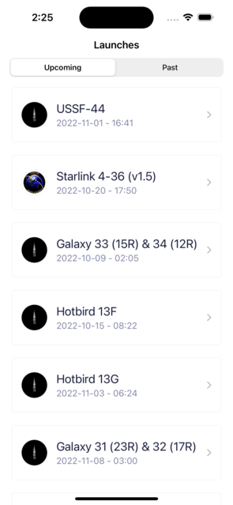
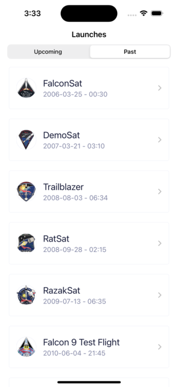
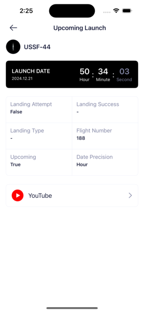
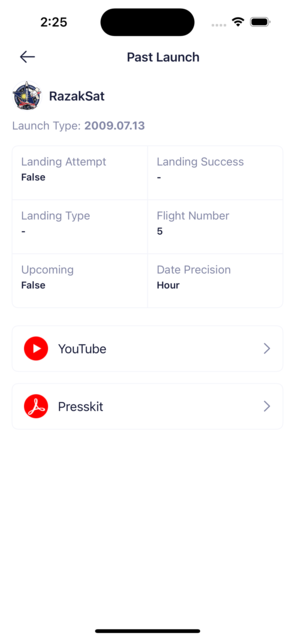

# SpaceX Launch App

This is a project to showcase an iOS application that displays SpaceX launches using the SpaceX API. The app is built with Swift using SwiftUI for the UI layer and Alamofire for network requests.

## Features
#####  Main Screen
- Segmented Tabs: Allows switching between Upcoming and Past launches.
- Launch List: Displays a list of launches with the following details:
    - Launch name
    - Launch date
    - Patch image (mission badge)
- Pull to Refresh: Users can refresh the data by pulling down on the list.
- Loading & Error Handling: Displays a loading indicator during data fetch and user-friendly error messages if something goes wrong.

#####  Detail Screen
- Mission Details: Shows:
    - Mission name
    - Patch image
    - Launch date (formatted based on the time of the launch)
    - For upcoming launches: A countdown timer.
    - For past launches: The formatted launch date.
    - Additional details about the launch.
- External Links: If available, displays:
   - YouTube video link for the mission.
   - Press kit link.
 - Error Handling: Displays appropriate error messages for failed data fetches.


### API Endpoints

SpaceX Document: [API Doc Link](https://github.com/r-spacex/SpaceX-API/blob/master/docs/README.md)
This app interacts with the SpaceX API to fetch launch data. The following endpoints are used:
|Endpoints||
|--------|--------|
| https://api.spacexdata.com/v5/launches/past | Get Past Launches |
| https://api.spacexdata.com/v5/launches/upcoming | Get Upcoming Launches |
| https://api.spacexdata.com/v5/launches/{id} | Launch Details |

### Technologies Used
- Swift
  - SwiftUI for building the user interface programmatically.
  - Combine framework for handling data flow and reactive updates.
- Alamofire
  - Simplifies network calls and response handling.
- Codable
  - Used for parsing JSON responses from the SpaceX API into Swift model objects.

### Architecture
The app is implemented using the MVVM (Model-View-ViewModel) design pattern to separate concerns and improve code maintainability:

- Model: Represents data fetched from the API.
- ViewModel: Handles business logic, prepares data for the view, and manages API calls.
- View: SwiftUI components render the user interface and react to changes in the ViewModel.

### How to Run the App

1. Clone this repository:
    ```bash
    git clone https://github.com/oktydeniz/learnconnect.git
    ```

2. Open the project in Xcode:
    ```bash
    open SpaceXLaunchApp.xcodeproj
    ```

3. Install dependencies using CocoaPods:
    ```bash
    pod install
    ```
4. Run the app on the simulator or a physical device.

## App Images

### Home Screens

Upcoming | Past
------ | --------
 | 


### Detail Screens

Upcoming | Past
------ | --------
 | 
